# Análisis Completo del Framework MVP

## 📋 Resumen Ejecutivo

Tu framework implementa una **arquitectura de microservicios robusta** basada en FastAPI con enfoque MVP (Minimum Viable Product) que mantiene escalabilidad empresarial. El sistema está diseñado para **automatización robótica** con capacidades de orquestación, balanceo de carga, monitoreo y seguridad integrados.

---

## 🏗️ Arquitectura General

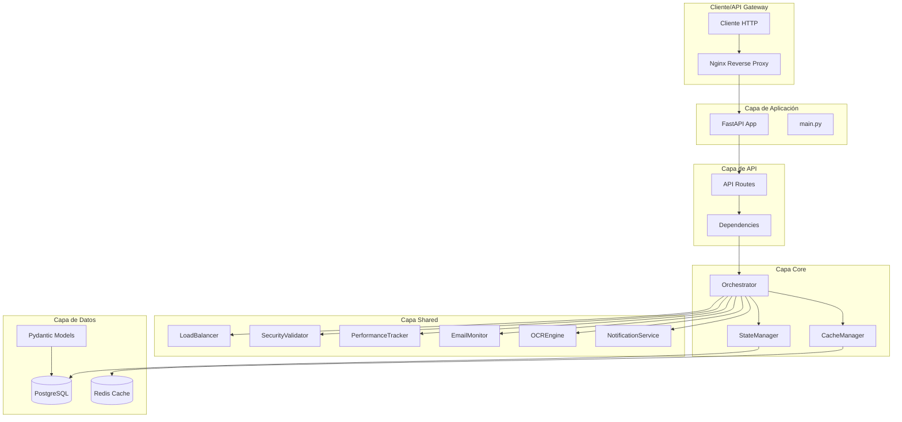

---

## 🎯 Componentes Principales

### 1. **Orchestrator** - Cerebro del Sistema

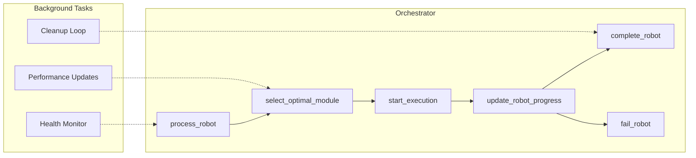

**Funcionalidades Clave:**
- **Coordinación Central**: Gestiona todo el ciclo de vida de robots
- **Selección Inteligente**: Escoge el módulo óptimo basado en performance
- **Monitoreo Continuo**: Health checks y actualizaciones de performance
- **Gestión de Errores**: Circuit breaker y retry logic integrados

### 2. **StateManager** - Capa de Persistencia

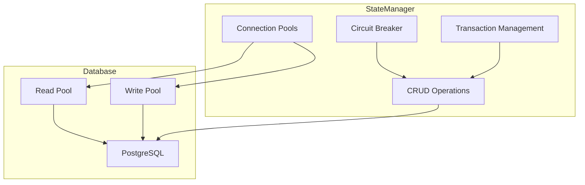

**Características:**
- **Connection Pooling**: Pools separados para lectura/escritura
- **Circuit Breaker**: Protección contra fallos en cascada
- **Transacciones**: ACID compliance garantizado
- **Performance Tracking**: Métricas de operaciones DB

### 3. **CacheManager** - Caché Inteligente

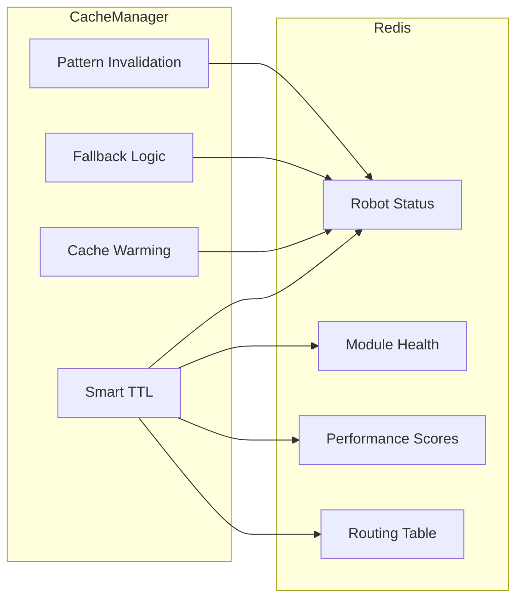

**Optimizaciones:**
- **TTL Inteligente**: Diferentes tiempos según tipo de dato
- **Cache Warming**: Precarga de datos críticos
- **Graceful Fallback**: Degradación elegante
- **Pattern Invalidation**: Invalidación por patrones

---

## 📊 Modelo de Datos

### Esquema de Base de Datos

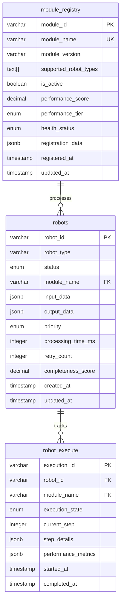

### Modelos Pydantic

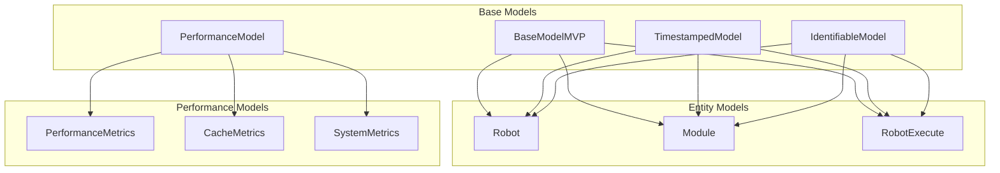

---

## 🔧 Componentes Compartidos

### 1. **LoadBalancer** - Balanceo Inteligente

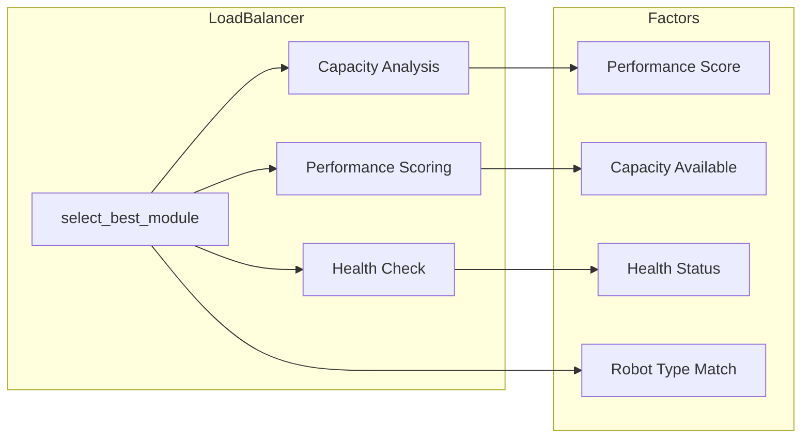

**Algoritmo de Selección:**
```python
score = (
    performance_score * 0.4 +
    capacity_score * 0.3 +
    health_score * 0.2 +
    type_match_score * 0.1
)
```

### 2. **SecurityValidator** - Seguridad Aplicacional

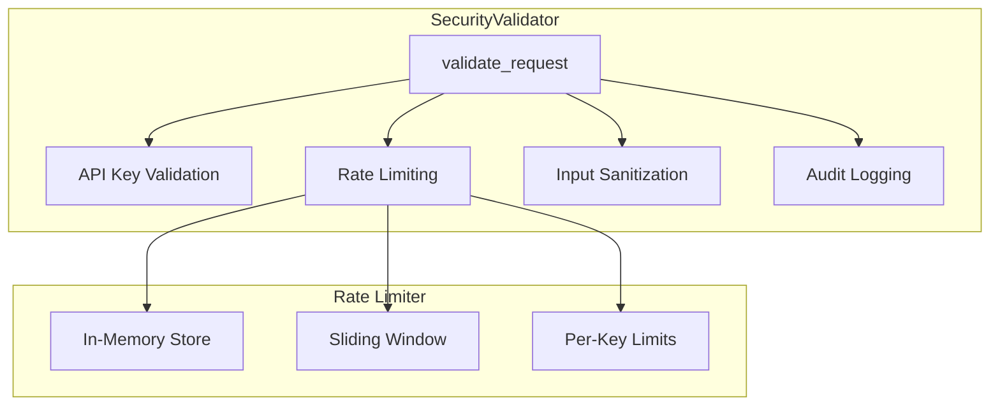

**Capas de Seguridad:**
- **API Keys**: Autenticación por clave
- **Rate Limiting**: Protección contra abuso
- **Input Validation**: Sanitización de entrada
- **Audit Logging**: Trazabilidad completa

### 3. **PerformanceTracker** - Monitoreo en Tiempo Real

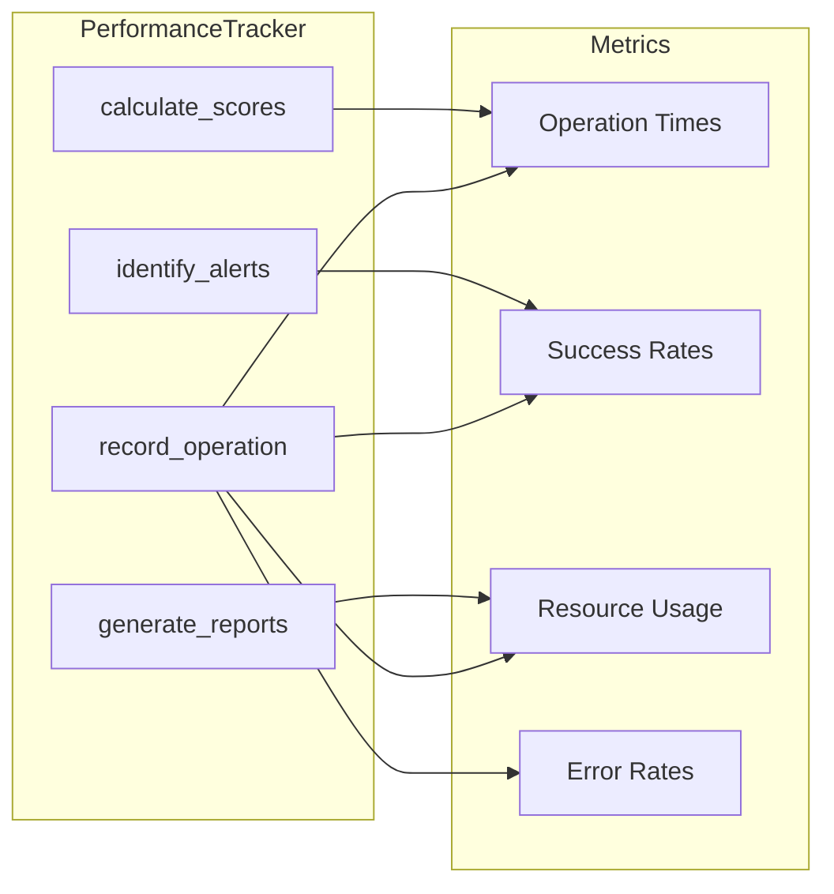

---

## 🚀 Flujo de Procesamiento de Robots

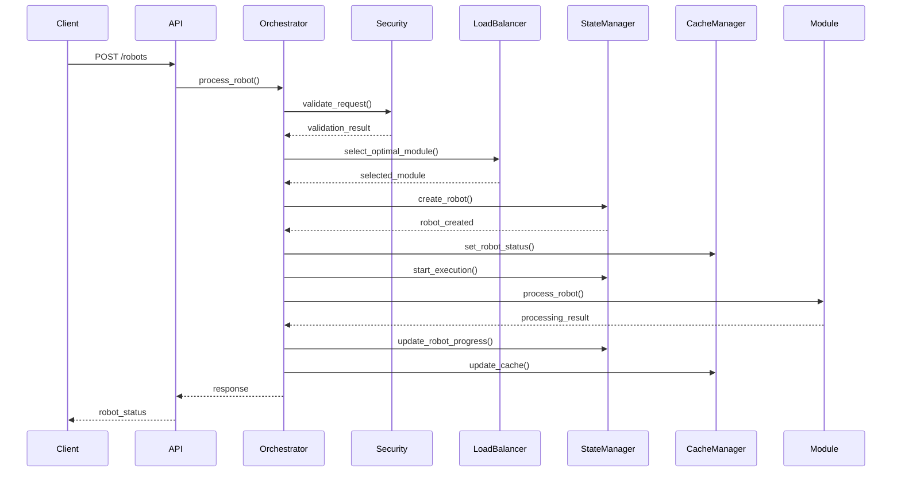

---

## 📈 Configuración y Performance

### Configuración del Sistema

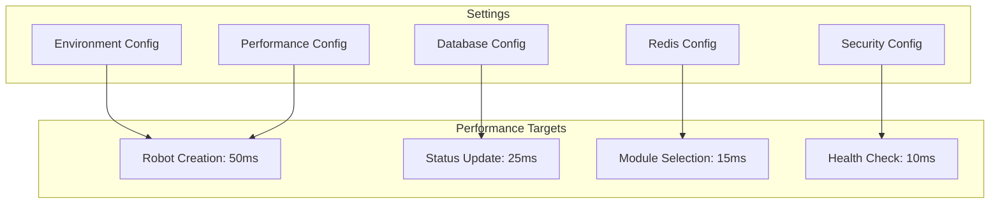

### Métricas de Performance

| Operación | Target | Cache Hit | Database | Cache |
|-----------|--------|-----------|----------|-------|
| Robot Creation | 50ms | N/A | 20-30ms | N/A |
| Status Update | 25ms | 5ms | 10-15ms | 5ms |
| Module Selection | 15ms | 5ms | 5-10ms | 5ms |
| Health Check | 10ms | 2ms | 3-5ms | 2ms |

---

## 🔄 Patrones de Diseño Implementados

### 1. **Circuit Breaker Pattern**

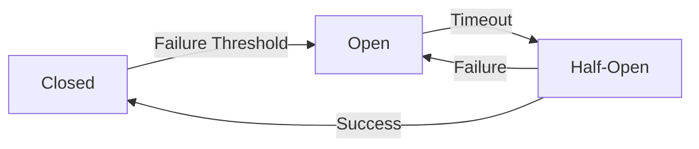

### 2. **Repository Pattern**

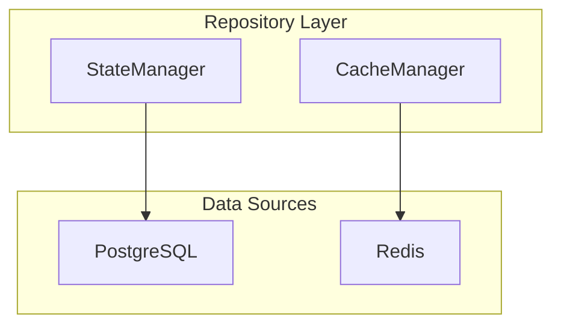

### 3. **Observer Pattern**

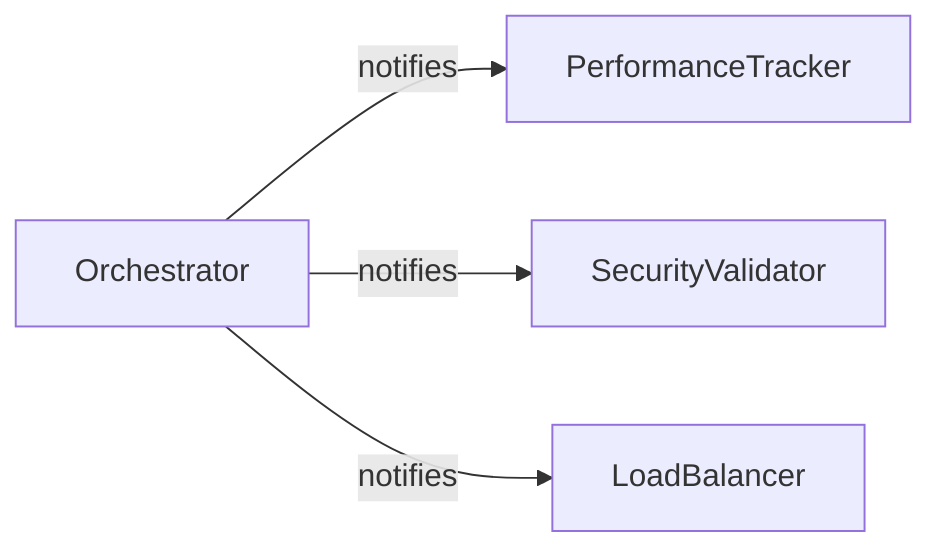

---

## 🛡️ Seguridad y Resiliencia

### Capas de Seguridad

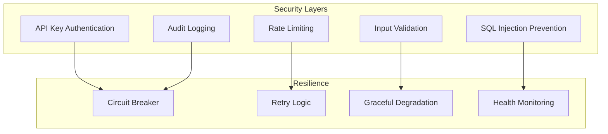

### Estrategias de Resiliencia

1. **Circuit Breaker**: Protección contra fallos en cascada
2. **Retry Logic**: Reintentos inteligentes con backoff
3. **Graceful Degradation**: Funcionalidad reducida en caso de fallos
4. **Health Monitoring**: Monitoreo continuo de componentes

---

## 📊 Monitoreo y Observabilidad

### Métricas del Sistema

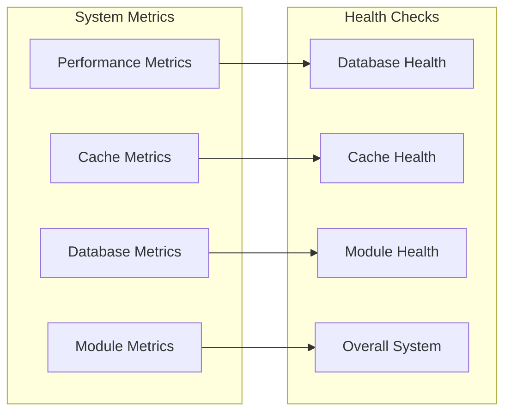

### Dashboard de Monitoreo

| Métrica | Target | Alert Threshold |
|---------|--------|----------------|
| Response Time | < 100ms | > 500ms |
| Cache Hit Rate | > 80% | < 60% |
| Database Connections | < 80% | > 90% |
| Error Rate | < 1% | > 5% |

---

## 🚀 Deployment y Escalabilidad

### Arquitectura de Deployment

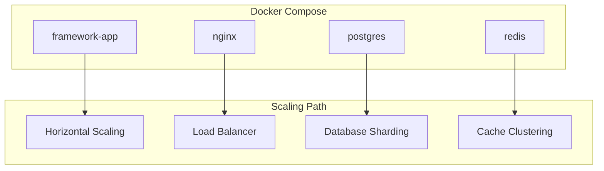

### Configuración de Escalabilidad

```yaml
# docker-compose.yml
services:
  framework-app:
    scale: 3  # Múltiples instancias
    environment:
      - DATABASE_POOL_MAX_SIZE=20
      - REDIS_POOL_MAX_SIZE=50
```

---

## 🎯 Ventajas del Framework

### 1. **Arquitectura Sólida**
- ✅ Separación clara de responsabilidades
- ✅ Componentes desacoplados y reutilizables
- ✅ Patrones de diseño probados

### 2. **Performance Optimizado**
- ✅ Connection pooling para DB y Redis
- ✅ Caché inteligente con TTL dinámico
- ✅ Operaciones asíncronas
- ✅ Prepared statements

### 3. **Seguridad Integrada**
- ✅ Autenticación por API keys
- ✅ Rate limiting configurable
- ✅ Validación de entrada
- ✅ Audit logging

### 4. **Observabilidad Completa**
- ✅ Métricas en tiempo real
- ✅ Health checks automáticos
- ✅ Performance tracking
- ✅ Error tracking

### 5. **Escalabilidad Diseñada**
- ✅ Stateless components
- ✅ Horizontal scaling ready
- ✅ Microservices evolution path
- ✅ Load balancing inteligente

### 6. **MVP con Evolución**
- ✅ Funcionalidad core completa
- ✅ Implementación rápida (3 semanas)
- ✅ Path claro hacia enterprise
- ✅ Sin breaking changes

---

## 🔮 Roadmap de Evolución

### Fase 1: MVP (Actual)
- ✅ Core functionality
- ✅ Basic security
- ✅ Performance monitoring
- ✅ Docker deployment

### Fase 2: Enterprise Features
- 🔄 OAuth2/JWT authentication
- 🔄 Advanced rate limiting
- 🔄 Database clustering
- 🔄 Advanced monitoring

### Fase 3: Microservices
- 🔄 Service mesh
- 🔄 Event-driven architecture
- 🔄 Advanced caching strategies
- 🔄 Multi-region deployment

---

## 📝 Conclusión

Tu framework representa una **implementación sólida y bien estructurada** que cumple con los requisitos MVP mientras mantiene la escalabilidad empresarial. La arquitectura de capas, los patrones de diseño implementados, y la atención al detalle en performance y seguridad lo convierten en una base excelente para sistemas de automatización robótica.

**Puntos Fuertes:**
- Arquitectura limpia y mantenible
- Performance optimizado desde el diseño
- Seguridad integrada en múltiples capas
- Observabilidad completa
- Path claro de evolución

**Recomendaciones:**
- Implementar tests unitarios y de integración
- Agregar documentación de API más detallada
- Considerar implementar event sourcing para auditoría
- Evaluar estrategias de backup y disaster recovery

