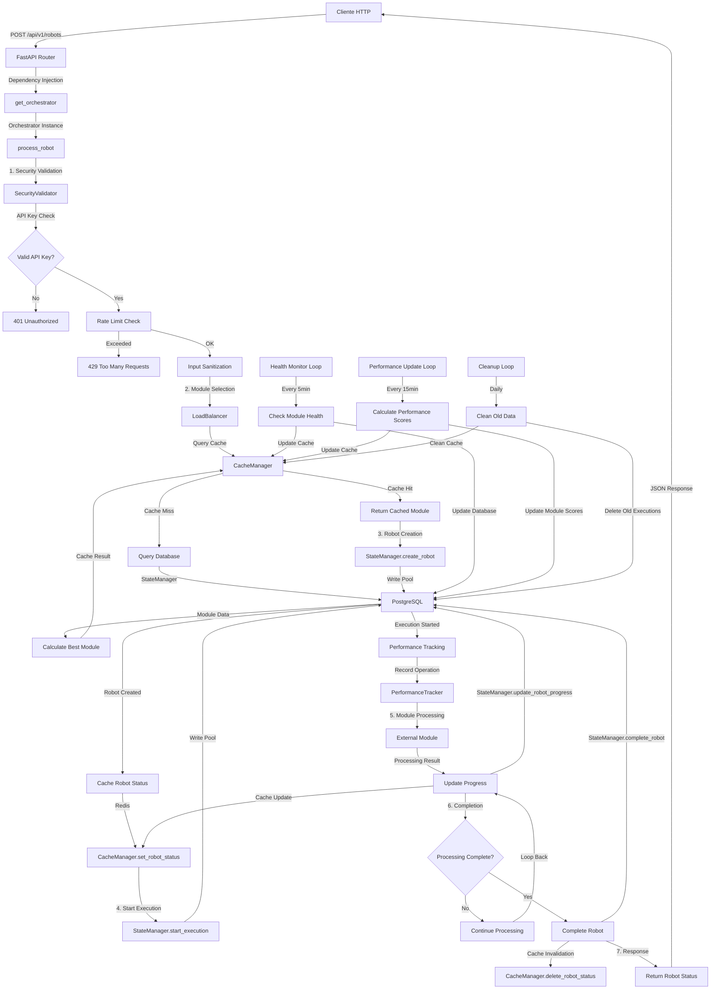
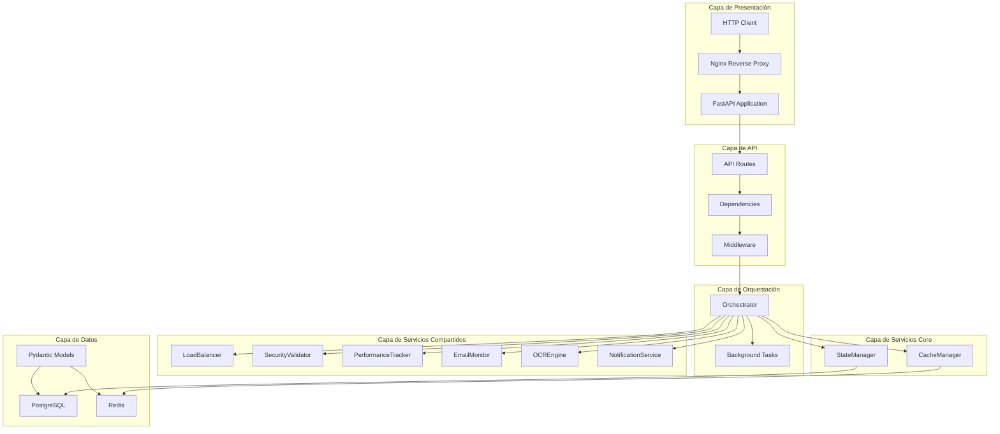
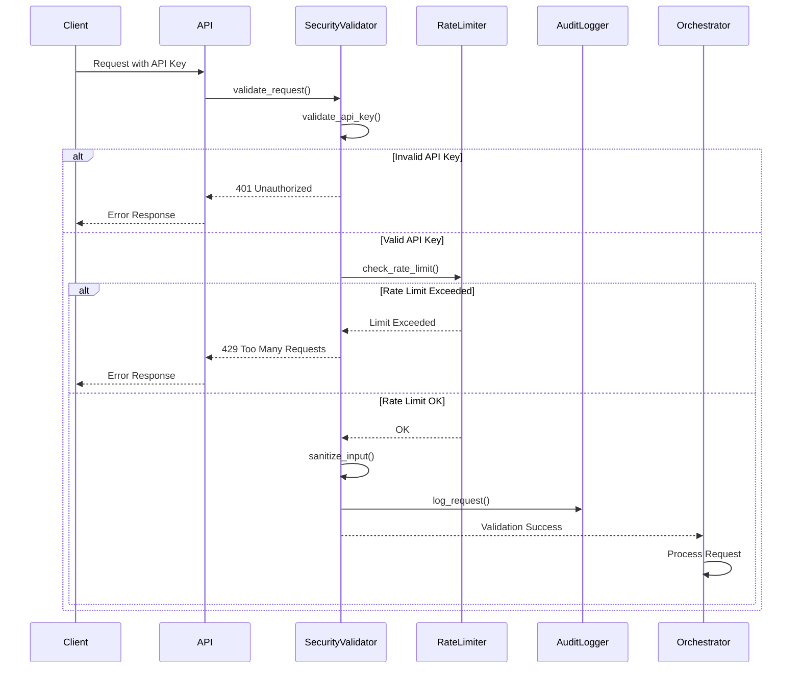
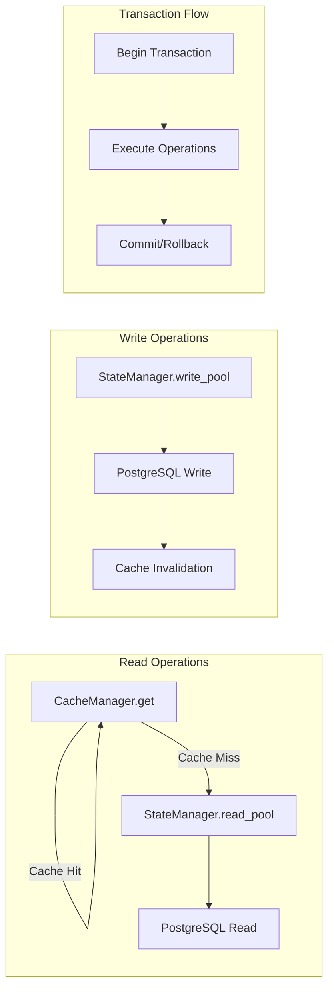
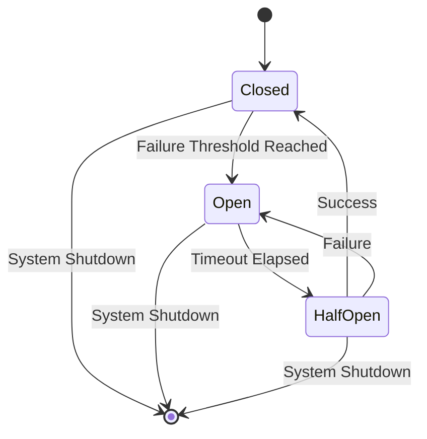
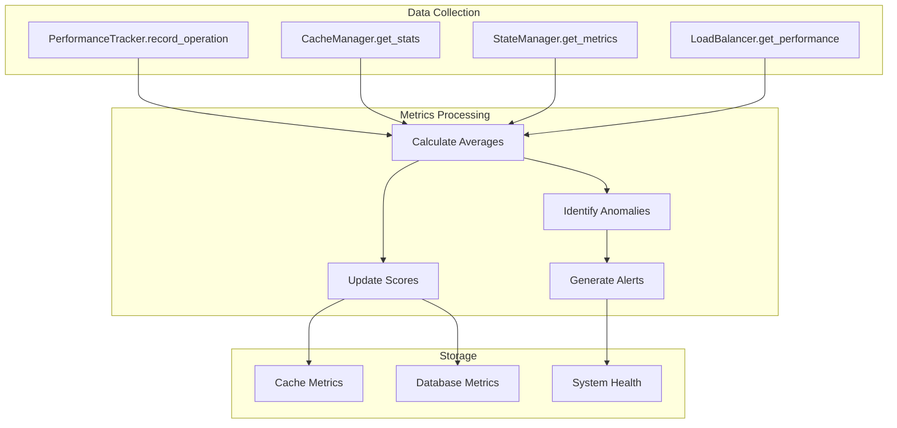
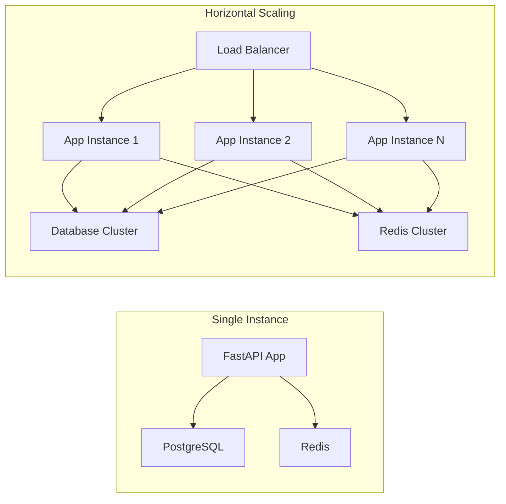
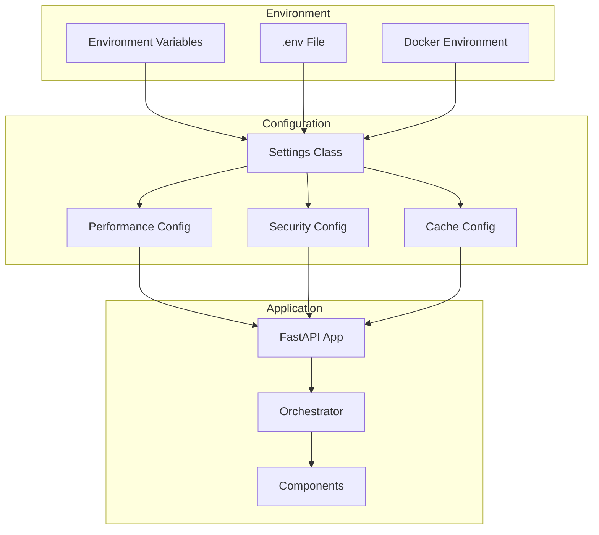

# Diagrama de Flujo de Datos - Framework MVP

## 🔄 Flujo Completo de Procesamiento

## 🏗️ Arquitectura de Capas Detallada

## 🔐 Flujo de Seguridad

## 💾 Flujo de Datos en Base de Datos

## 🔄 Patrón Circuit Breaker

## 📊 Flujo de Métricas y Monitoreo

## 🚀 Flujo de Escalabilidad

## 🔧 Flujo de Configuración

## 📝 Resumen de Interacciones

### 1. **Flujo Principal de Robot**
1. **Validación de Seguridad** (5-10ms)
2. **Selección de Módulo** (10-15ms)
3. **Creación de Robot** (20-30ms)
4. **Inicio de Ejecución** (5-10ms)
5. **Procesamiento** (Variable)
6. **Actualización de Estado** (10-15ms)

### 2. **Optimizaciones de Performance**
- **Connection Pooling**: Pools separados para lectura/escritura
- **Caché Inteligente**: TTL dinámico según tipo de dato
- **Prepared Statements**: Prevención de SQL injection
- **Operaciones Asíncronas**: No-blocking I/O

### 3. **Patrones de Resiliencia**
- **Circuit Breaker**: Protección contra fallos en cascada
- **Retry Logic**: Reintentos con backoff exponencial
- **Graceful Degradation**: Funcionalidad reducida en fallos
- **Health Monitoring**: Monitoreo continuo de componentes

### 4. **Capas de Seguridad**
- **API Key Authentication**: Autenticación por clave
- **Rate Limiting**: Protección contra abuso
- **Input Validation**: Sanitización de entrada
- **Audit Logging**: Trazabilidad completa

Este framework implementa una arquitectura robusta y escalable que mantiene la simplicidad del MVP mientras proporciona una base sólida para evolución empresarial.

